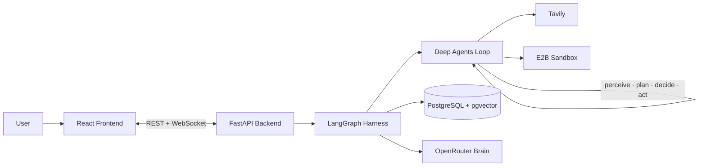

# BA Agent — Product Requirements Document (v2)

| | |
|---|---|
| **Version** | 2.0 |
| **Status** | Approved for build |
| **Date** | 2026-08-24 |
| **Supersedes** | v1 (7-analyst architecture with CrewAI Flows) |

---

## 1. Overview

The BA Agent is a **business analytics agent**: an autonomous system that **perceives its environment, plans, decides, and acts** to answer business questions through an enforced, deterministic 6-stage methodology — *Problem Definition → Data Collection → Data Preparation → Analysis → Interpretation → Recommendation* — with human-in-the-loop (HITL) governance at configurable stage boundaries.

The agent is not a workflow executor with a friendly prompt. It is a single continuous agent loop whose **missions** are scoped by the methodology, whose **exits** are governed by validated Stage Contracts, and whose **gates** are owned by the harness — not by the agent.

### Elevator pitch

> Ask a business question. The agent frames it, hunts the data, prepares it under contract, analyzes with real executed code, interprets the business meaning, and delivers a defensible recommendation — pausing at the two moments that matter most for *your* judgment, and never forwarding debt from one stage to the next.

---

## 2. Goals & Non-Goals

### Goals
1. Enforce the 6-stage methodology **topologically** — stages cannot be skipped or reordered.
2. Guarantee **accuracy through contracts**: no stage exits without a signed, validated Stage Contract; every downstream stage trusts its inputs absolutely (**No-Debt-Forward**).
3. Provide **tiered HITL governance**: mandatory human gates at Stages 1 and 6; reviewable, configurable gates at Stages 2–5.
4. Deliver a **defensible evidence chain**: every final recommendation is traceable back to Stage 1 success criteria through Stage 4 evidence and Stage 5 reasoning.
5. Run computation **sandboxed** (E2B) — analysis code actually executes; no hallucinated numbers.
6. Provide a **product-grade web UI** (React + FastAPI) with live agent streaming, rich gate interactions, artifact inspection, and evidence viewing.
7. Support **auth from day one** — users own their engagements.
8. Build **one analyst first**, with the architecture ready to fan out to a specialist team later without harness changes.

### Non-Goals (v2)
- Multi-analyst specialist team (future).
- Cross-engagement semantic memory via pgvector (future).
- RBAC / roles / permissions (future; basic user ownership only).
- Managed/hosted Deep Agents deployment (future).
- Real-time time-travel UI (checkpointing backend only, for now).

---

## 3. Core Principles

| Principle | Meaning |
|---|---|
| **Rails, not cages** | Methodology is enforced by graph topology; autonomy is granted *within* a stage, never across stages. |
| **No-Debt-Forward** | A problem discovered in a stage is resolved in that stage. No gaps, no "flagged issues" travel forward. The gate is the *only* escalation point; a human resolution there **amends** the contract, never waives it. |
| **Contracts as law** | Each stage has a Stage Contract: input requirements + artifact schema + hard validation rules + GateMode. No contract, no door. |
| **Harness owns the gates** | The agent cannot skip, request-waive, or self-approve a gate. It may *request* early review; it cannot exit without review where review is mandated. |
| **State by artifacts, not analysts** | Shared state is organized by stage artifacts. Future specialist fan-out changes node internals only — never the harness or state shape. |
| **Evidence chain** | Every claim is traceable: Recommendation → Interpretation → Analysis findings → prepared data → collected sources → approved mandate. |
| **UI is replaceable skin** | All agent logic lives UI-agnostic in the backend. The frontend is a thin presentation layer over a stable API. |
| **Performance first** | Streaming is event-driven (WebSocket, zero polling). Large result sets are paginated/virtualized. The agent's loop never blocks on the UI. |

---

## 4. System Architecture



### Layer responsibilities
- **React Frontend** — presentation only: pipeline tracker, live agent stream, gate modals, artifact inspector, evidence viewer, decision log, session management.
- **FastAPI Backend** — API surface, WebSocket event streaming, gate state machine, auth, session registry; hosts the LangGraph runtime in-process.
- **LangGraph Harness** — graph topology, checkpointing, interrupts, retries, contract validation nodes.
- **Deep Agents Loop** — the perceive→plan→decide→act engine; one mission per stage.
- **PostgreSQL + pgvector** — checkpoints, artifact store, engagement registry, users, vector memory (future).
- **OpenRouter** — model gateway with per-stage routing.

---

## 5. The Agent Core

### 5.1 The loop

```
PERCEIVE → PLAN → DECIDE → ACT  (repeats)
```

- **Perceive** — files, ingested data, tool outputs, human feedback, prior artifacts (injected from shared state every cycle), environment descriptor.
- **Plan** — Deep Agents Planner LLM decomposes the stage mission into steps.
- **Decide** — think-then-act reasoning selects the next action.
- **Act** — tool execution: E2B code, Tavily search, file operations, subagent delegation.

### 5.2 Mission model (Option B — ratified)

The agent is one continuous engine executing **six scoped missions** (one per stage). Each mission: `{mission prompt + goal, scoped tools, output contract, gate mode}`. The same engine, six mandates, gates between missions where interrupts are clean.

### 5.3 Single analyst first

v2 ships exactly **one analyst** — the generic BA — parameterized per stage by persona prompts. The graph is a **linear chain**; there is no supervisor, no fan-out, no synthesis node. The fan-out architecture (Stage 2 collectors, Stage 4 specialist analysts, mandatory Communication Analyst synthesis) is designed-for but **not built** in v2. State is organized by stage artifacts so fan-out later requires zero harness changes.

---

## 6. The 6-Stage Methodology

### 6.1 Stage map

| # | Stage | Mission | Tools | Brain tier | Gate | Artifact |
|---|---|---|---|---|---|---|
| 1 | Problem Definition | Sharpen the request into a mandate: scope, objectives, success criteria, key questions | **None** | Strong | 🔴 BLOCK | `ProblemDefinition` |
| 2 | Data Collection | Locate, acquire, and **ingest** data with provenance | Tavily, filesystem, PostgreSQL | Efficient | 🟢 REVIEW-ABLE | `CollectionManifest` |
| 3 | Data Preparation | Clean, validate, transform; issue the Data Contract | E2B (Python), filesystem | Strong | 🟢 REVIEW-ABLE | `PreparedDataset` |
| 4 | Analysis | Compute, test, extract patterns — with evidence | E2B (heavy), PostgreSQL | Strong | 🟢 REVIEW-ABLE | `AnalysisReport` |
| 5 | Interpretation | Translate statistics into business meaning | **None (pure)** | Strong | 🟢 REVIEW-ABLE | `Interpretation` |
| 6 | Recommendation | Actionable, prioritized, traceable recommendations | **None** | Strong | 🔴 BLOCK | `Recommendation` |

### 6.2 Stage details

**Stage 1 — Problem Definition (the anchor)**
- Perceives: user request + feedback only. Deliberately no data, no web (prevents premature anchoring).
- Persona: *"analyst clarifying mandate."*
- Gate G1 is the first human checkpoint; the approved artifact becomes the law for every later stage.

**Stage 2 — Data Collection (the hunter)**
- **Ingestion lives here** (ratified for accuracy): raw formats (CSV/Excel/PDF/JSON/Word) are converted to structured data *at acquisition* — parse failures surface while the source is still reachable; the manifest reports real schemas and row counts; Stage 3 cleans on verified structure, not guesses.
- Missing data is a first-class field and **must be resolved in-stage** (re-fetch, alternative source, derive) — or the contract fails and the gate escalates to the human.

**Stage 3 — Data Preparation (the refiner)**
- Cleaning pipelines execute in E2B. Issues the **Data Contract**: per-field semantic meaning, type, range, quality flags, transformations, source references.
- Quality metrics and limitations must be consistent — a dirty dataset claiming no limitations fails validation.

**Stage 4 — Analysis (the intellect)**
- Heavy computation in E2B (pandas, scipy, statsmodels). Highest recursion limit in the graph.
- **No evidence, no finding**: every finding must reference a real computed output artifact.

**Stage 5 — Interpretation (the translator)**
- **Purity enforced**: no tools, no external context. Reasoning only from Stage 4 evidence + Data Contract limitations.
- Every causal claim is labeled `evidence_supported | plausible | speculative`; rival explanations are required.

**Stage 6 — Recommendation (the deliverable)**
- Every recommendation cites ≥1 Stage 1 success criterion; every criterion is addressed or explicitly deferred.
- Rationale must trace: success criterion ← finding ← hypothesis.

---

## 7. Stage Contracts

### 7.1 Contract model

Each Stage Contract declares:
- **Input requirements** — which prior artifacts must exist and be signed
- **Artifact schema** — pydantic model of the output
- **Hard rules** — validation checks; failure bounces the artifact back into the stage (in-stage fix loop)
- **GateMode** — `BLOCK` | `REVIEW_ABLE`

### 7.2 `ProblemDefinition` (Stage 1)

```json
{
  "problem_statement": "string — 1-3 sentences, must show interpretation, not verbatim user request",
  "objectives": ["string — tied to measurable outcomes"],
  "success_criteria": ["string — MUST contain metric + target + time horizon"],
  "scope": {"included": ["string"], "excluded": ["string"]},
  "stakeholders": [{"role": "string", "interest": "string"}],
  "constraints": ["string"],
  "assumptions": ["string"],
  "key_questions": ["string — each MUST be answerable with data"]
}
```

**Hard rules**
1. ≥ 1 success criterion matches `metric + target + horizon` pattern.
2. `problem_statement` ≠ verbatim user request (interpretation visible).
3. ≥ 1 key question; all must be data-answerable.

### 7.3 `CollectionManifest` (Stage 2)

```json
{
  "sources": [{
    "source_id": "string",
    "source_type": "web | file | database | api",
    "location": "string",
    "acquired_at": "ISO timestamp",
    "provenance_notes": "string",
    "ingestion": {
      "format": "csv | excel | pdf | json | word | sql",
      "status": "success | partial | failed",
      "records_extracted": "int",
      "parse_errors": ["string"],
      "schema_extracted": [{"field": "string", "inferred_type": "string"}]
    }
  }],
  "coverage": [{"key_question_ref": "string", "covered_by": ["source_id"], "gaps": ["string"]}],
  "missing_data": [{"what": "string", "why": "string", "impact": "string", "resolved_in_stage": true}],
  "access_issues": ["string"],
  "overall_status": "complete"
}
```

**Hard rules**
1. Every Stage 1 key question appears in `coverage` — unanswered = fail.
2. Every `missing_data` entry has `resolved_in_stage: true` — no gaps forward.
3. No failed-ingestion source may silently disappear (must be in `missing_data` or re-fetched).
4. `overall_status` must be `complete` — anything else escalates to the gate.

### 7.4 `PreparedDataset` (Stage 3)

```json
{
  "dataset": {
    "location": "string",
    "row_count": "int",
    "column_count": "int",
    "primary_key": "string | null",
    "granularity": "string",
    "time_range": {"start": "date", "end": "date"}
  },
  "data_contract": {
    "version": "string",
    "fields": [{
      "name": "string",
      "semantic_meaning": "string — BUSINESS meaning of the field",
      "data_type": "string",
      "allowed_values_or_range": "string",
      "nullability": "bool",
      "quality_flags": ["missing_high | duplicates | outliers | format_inconsistent"],
      "transformations_applied": ["string"],
      "source_ref": "source_id.field"
    }]
  },
  "quality_metrics": {
    "missingness_percent": "float",
    "duplicate_rate": "float",
    "validation_errors": ["string"]
  },
  "cleaning_log": ["string"],
  "limitations": [{"limitation": "string", "impact_on_analysis": "string"}]
}
```

**Hard rules**
1. Every field has `semantic_meaning` — no unnamed columns.
2. Poor quality metrics require matching `limitations` entries.
3. Non-empty `cleaning_log` whenever transformations were applied.

### 7.5 `AnalysisReport` (Stage 4)

```json
{
  "methodology": [{"step": "string", "method": "string", "justification": "string"}],
  "findings": [{
    "finding_id": "string",
    "statement": "string",
    "evidence": {
      "computed_output_ref": "string — MUST reference a real E2B artifact",
      "key_numbers": {"metric": "string", "value": "number", "unit": "string"},
      "statistical_test": {"test": "string", "statistic": "number",
                            "p_value": "number | null", "significant": "bool"} | null
    },
    "answers_question": "ref to key_question",
    "confidence": "high | medium | low",
    "caveats": ["string"]
  }],
  "open_questions": ["string"],
  "artifacts": [{"name": "string", "type": "chart | table | script", "location": "string"}]
}
```

**Hard rules**
1. **No evidence, no finding** — `computed_output_ref` mandatory per finding.
2. Every Stage 1 key question maps to ≥ 1 finding **or** appears in `open_questions`.
3. `p_value` present whenever a significance claim is made.

### 7.6 `Interpretation` (Stage 5)

```json
{
  "business_meaning": [{
    "finding_ref": "finding_id",
    "so_what": "string",
    "magnitude_of_impact": "string — estimated, with basis",
    "affected": ["string"]
  }],
  "causal_hypotheses": [{
    "hypothesis": "string",
    "status": "evidence_supported | plausible | speculative",
    "supporting_evidence_refs": ["finding_id"],
    "rival_explanations": ["string"],
    "testability": "string"
  }],
  "risks": [{"risk": "string", "likelihood": "low|medium|high",
             "impact": "low|medium|high", "mitigation_hint": "string"}],
  "implications": ["string"],
  "what_would_change_conclusions": ["string"]
}
```

**Hard rules**
1. Every Stage 4 finding is interpreted or explicitly flagged in `what_would_change_conclusions` — no orphan findings.
2. Every causal claim carries a `status` label.
3. Claims about external benchmarks fail validation (purity enforced at contract level).

### 7.7 `Recommendation` (Stage 6)

```json
{
  "recommendations": [{
    "recommendation_id": "string",
    "action": "string — specific verb + object",
    "rationale": "string — trace: success_criterion ← finding ← hypothesis",
    "expected_impact": {"metric": "string", "estimate": "string", "basis": "refs"},
    "effort": {"level": "low|medium|high", "estimate": "string"},
    "cost_estimate": "string | null",
    "risks": ["string"],
    "priority": "critical | high | medium | low",
    "depends_on": ["recommendation_id"],
    "success_criteria_ref": "ref"
  }],
  "alternatives_considered": [{"alternative": "string", "rejected_because": "string"}],
  "final_summary": "string",
  "next_steps": ["string"],
  "overall_confidence": "high | medium | low"
}
```

**Hard rules**
1. Every recommendation cites ≥ 1 Stage 1 success criterion.
2. Every success criterion is addressed by ≥ 1 recommendation or explicitly deferred with reason.
3. `rationale` must reference real findings/hypotheses — uncited rationale fails.

### 7.8 Traceability chain

Each stage's hard rules reference the previous stage's contract: Stage 2 covers Stage 1's questions → Stage 4 answers them → Stage 5 interprets Stage 4's findings → Stage 6 satisfies Stage 1's criteria. Six documents, one chain of trust.

---

## 8. HITL Policy

### 8.1 Tiered gates

| Gate | After stage | Mode | Default behavior |
|---|---|---|---|
| G1 | 1 | `BLOCK` | Mandatory human approval/edit/regenerate |
| G2 | 2 | `REVIEW_ABLE` | Auto-progress; artifact logged |
| G3 | 3 | `REVIEW_ABLE` | Auto-progress; artifact logged |
| G4 | 4 | `REVIEW_ABLE` | Auto-progress; artifact logged |
| G5 | 5 | `REVIEW_ABLE` | Auto-progress; artifact logged |
| G6 | 6 | `BLOCK` | Mandatory human approval or send-back |

- Any REVIEW-ABLE gate can be configured to `BLOCK` via config.
- Default run: exactly **2 human interruptions** (G1, G6); range 2–6.
- The agent may *request* early review at any REVIEW-ABLE gate; it can never skip one.

### 8.2 Gate flow

1. Stage completes → contract validation (in-stage fix loop on failure).
2. Gate node evaluates `GateMode`:
   - `BLOCK` → `interrupt()` with payload `{gate_id, artifact, question}`.
   - `REVIEW_ABLE` → log artifact, auto-open door.
3. Human decision: `approve` | `edit` | `regenerate` (G1) / `approve` | `send_back` (G6, with target stage + feedback).
4. Resume via `Command(resume, value)`; feedback injected into shared state; loop-back edges route to the offending stage.

### 8.3 Gate state machine (backend-owned, tested)

`gate_open → awaiting_decision → resumed | looped_back` — centralized module with regression tests on transitions.

---

## 9. State & Memory

### 9.1 Shared state regions

```
Control:   current_stage, stage_statuses, retries, error
UserLoop:  user_request, context (messages), feedback (per stage)
Artifacts: problem_definition, collection_manifest, prepared_dataset,
           analysis_report, interpretation, recommendation   ← signed contracts
Runtime:   decision_log[], env_descriptor, model_routing
```

### 9.2 Three-tier memory

| Tier | Mechanism | Role |
|---|---|---|
| Working | Shared state (injected every cycle) | Prior artifacts, feedback, decision log |
| Session | Deep Agents Context Hub | What the agent did within the current mission |
| Long-term | PostgreSQL checkpoints + artifact store | Crash recovery, resume, time travel; future pgvector semantic recall over past engagements |

---

## 10. Tech Stack

### Backend
| Component | Choice |
|---|---|
| Language | Python 3.11+ |
| Harness | LangGraph (StateGraph, interrupt, checkpointing, RetryPolicy) |
| Agent loop | LangChain Deep Agents (`langchain-deepagents`) |
| Brain gateway | OpenRouter (per-stage model IDs via config) |
| Contracts | Pydantic v2 |
| API | FastAPI + Uvicorn |
| Streaming | WebSocket (event-driven, zero polling) |
| Auth | JWT (OAuth2 password flow, python-jose, passlib) |
| DB | PostgreSQL + pgvector (Docker) |
| Tools | Tavily (`tavily-python`), E2B sandbox |
| Ingestion | pandas + openpyxl, pdfplumber, python-docx |
| Config | pydantic-settings + .env |

### Frontend
| Component | Choice |
|---|---|
| Framework | Vite + React + TypeScript |
| Styling | Tailwind CSS |
| Server state | TanStack Query |
| UI state | Zustand |
| Routing | React Router |
| Charts | plotly.js-react (renders E2B-produced Plotly JSON figures untouched) |
| Real-time | WebSocket client + event store |

### Infrastructure
- Docker Compose: `pgvector/pgvector:pg16` + backend + frontend
- GitHub (auto commit + push after every change)

---

## 11. Backend API Design

### 11.1 REST

| Method | Path | Purpose |
|---|---|---|
| POST | `/auth/register` | Create user |
| POST | `/auth/login` | JWT issue |
| GET | `/engagements` | List user's engagements (paginated) |
| POST | `/engagements` | Create engagement (business question) |
| GET | `/engagements/{id}` | Engagement detail + stage status |
| POST | `/engagements/{id}/resume` | Resume from checkpoint |
| GET | `/engagements/{id}/artifacts` | Signed artifacts per stage |
| GET | `/engagements/{id}/artifacts/{stage}` | Single artifact (formatted + raw) |
| GET | `/engagements/{id}/decision-log` | Agent reasoning trail |
| POST | `/gates/{gate_id}/decision` | `approve | edit | send_back` + feedback |
| POST | `/engagements/{id}/files` | Local file import (feeds Stage 2 ingestion) |

### 11.2 WebSocket events (server → client)

| Event | Payload |
|---|---|
| `agent_step` | plan/tool-call/result from the Deep Agents loop |
| `stage_started` | stage id, mission summary |
| `stage_completed` | stage id, contract status |
| `contract_failed` | stage id, hard rules violated, fix-loop notice |
| `gate_open` | gate id, artifact, question |
| `gate_closed` | gate id, decision |
| `engagement_completed` | final summary, artifact refs |
| `error` | structured error report |

Client → server: only via REST commands (no client-driven graph control).

---

## 12. Frontend Blueprint

### 12.1 Pages
1. **Login** — email + password.
2. **Engagements home** — card grid, search, pagination (large result sets stay usable), resume, "new engagement".
3. **Engagement view (3-pane command center)**
   - Left: session info, pipeline tracker (6-step stepper), decision log timeline.
   - Center: agent stream (live perceive→plan→decide→act feed, thinking toggle).
   - Right: artifact inspector (formatted + raw JSON), evidence viewer (Plotly charts, tables).
4. **Gate modal** (overlay): G1 — approve / edit inline / regenerate + feedback; G6 — approve / send back to stage + feedback.

### 12.2 Components
`PipelineTracker` · `AgentStream` · `GateModal` · `ArtifactInspector` · `EvidenceViewer` · `DecisionLogTimeline` · `SessionSidebar` · `FileDropZone` · `FocusModeToggle`

### 12.3 UX requirements (user preferences ratified)
- **Performance first**: virtualized lists for large artifacts/history; streaming renders are incremental; the UI never blocks on agent work.
- **Focus mode**: one-click toggle hiding non-essential panes (left/right rails) — only the agent stream + chat remain. Exit control clearly visible and non-overlapping with critical actions.
- **Local file integration**: drag-and-drop import of desktop files into the engagement; files feed Stage 2 ingestion directly.
- **Result visibility**: generous containers for artifacts/search results; evidence charts render large and inspectable.

---

## 13. Data Model (PostgreSQL)

```
users        (id, email, password_hash, created_at)
engagements  (id, user_id FK, question, status, current_stage, created_at, updated_at)
artifacts    (id, engagement_id FK, stage, artifact_type, content JSONB, contract_version,
              signed_at, validation_status)
gate_decisions (id, engagement_id FK, gate_id, decision, feedback, decided_at)
checkpoints  (LangGraph PostgresSaver tables)
files        (id, engagement_id FK, original_name, stored_path, ingested_status)
```

---

## 14. Configuration (`.env`)

```
OPENROUTER_API_KEY=
TAVILY_API_KEY=
E2B_API_KEY=
DATABASE_URL=postgresql://ba:ba@localhost:5432/ba_agent
JWT_SECRET=
MODEL_STRONG=        # Stages 1, 4, 5, 6
MODEL_EFFICIENT=     # Stages 2, 3
GATE_MODE_S2=REVIEW_ABLE   # G2..G5 configurable
GATE_MODE_S3=REVIEW_ABLE
GATE_MODE_S4=REVIEW_ABLE
GATE_MODE_S5=REVIEW_ABLE
```

---

## 15. Testing Strategy

| Layer | Coverage |
|---|---|
| Contract tests | Every hard rule, per stage (valid/invalid fixtures) |
| Gate state machine | Transitions + regression tests (policy-level, not widget mocks) |
| Graph tests | Topology (no skipping), interrupt/resume, loop-back routing |
| Ingestion tests | CSV/Excel/PDF/JSON/Word fixtures incl. malformed inputs |
| API tests | Auth, engagement lifecycle, gate decisions |
| Frontend | Component tests (gate modal, tracker), integration against mock WS |
| Smoke | End-to-end: question → G1 → … → G6 → recommendation |

---

## 16. Milestones

| M | Scope | Exit criteria |
|---|---|---|
| M1 | Scaffold + contracts + graph core | 6 contracts with tests; linear graph runs with stub models |
| M2 | Deep Agents missions + tools | Real missions per stage; E2B + Tavily wired; in-stage fix loop |
| M3 | Backend API + auth + WS | REST + WebSocket + gate flow end-to-end (CLI testable) |
| M4 | React frontend | Login, engagement view, gate modals, artifact inspector, evidence viewer |
| M5 | Hardening | Full test suite green, Docker Compose one-command up, perf pass |

---

## 17. Future Work

- **Analyst team**: fan-out at Stage 2 (collectors) and Stage 4 (specialists) + mandatory Communication Analyst synthesis — state shape already supports it.
- **Cross-engagement memory**: pgvector semantic recall over past recommendations.
- **RBAC** and multi-user collaboration.
- **Time-travel UI** over checkpoints.
- **Managed Deep Agents** deployment path.

---

## 18. Risks & Mitigations

| Risk | Mitigation |
|---|---|
| Model hallucinates numbers | E2B execution + evidence-required contract rules |
| LLM skips/mangles methodology | Topological enforcement + contract validation |
| Unparseable/absent data | Ingestion at acquisition; in-stage resolution; gate escalation |
| Async/streaming state bugs (UI freezes) | Event-driven WS (no polling); centralized gate state machine with tests |
| Cost explosion (long agent runs) | Tiered models, recursion limits, timeout guards, streaming cost visibility |
| Docker/DB instability | Docker Compose pinning; healthchecks; documented recovery |
